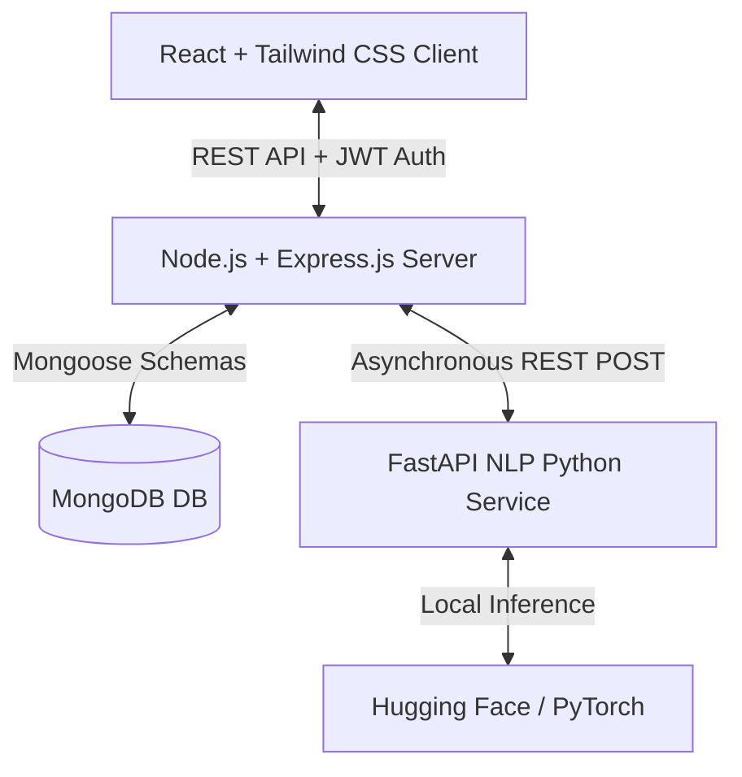

# StudyMate - AI-Powered Student Learning Assistant

StudyMate is a lightweight, clean, full-stack AI study companion for students. The application allows users to register or log in, drag-and-drop PDF study materials, generate automated concise summaries and keyword indices, and ask AI-powered context-specific questions about the document in an interactive chat interface.

---

## 🚀 Quick Start Guide

StudyMate consists of three service parts. To run the complete system locally, follow these steps to boot each service in separate terminal windows.

### Prerequisites
- **Node.js** (v16.0 or higher)
- **Python** (v3.9 or higher)
- **MongoDB** running locally on default port `27017` (e.g., MongoDB Community Server) or a MongoDB Atlas Cloud URI.

---

### Step 1: 🐍 Start the NLP Microservice (Python FastAPI)
This service uses FastAPI, PyMuPDF, and Hugging Face Transformers (`distilbart-cnn-12-6` and `roberta-base-squad2`) to extract, summarize, and answer questions about PDF files.

1. Open a new terminal and navigate to the `nlp-service` directory:
   ```bash
   cd nlp-service
   ```
2. Create and activate a Python virtual environment:
   * **Windows (PowerShell)**:
     ```powershell
     python -m venv venv
     .\venv\Scripts\activate
     ```
   * **macOS / Linux**:
     ```bash
     python3 -m venv venv
     source venv/bin/activate
     ```
3. Install the required dependencies:
   ```bash
   pip install -r requirements.txt
   ```
4. Start the Uvicorn local server:
   ```bash
   uvicorn main:app --reload --port 8000
   ```
   *The NLP service will be running at:* `http://127.0.0.1:8000`

---

### Step 2: 🟢 Start the Backend Server (Express & Node.js)
This service acts as the main API controller, database interface via Mongoose/MongoDB, and routes file uploads.

1. Open a second terminal and navigate to the `server` directory:
   ```bash
   cd server
   ```
2. Install npm dependencies:
   ```bash
   npm install
   ```
3. Create the uploads directory and configure variables (Default `.env` already provided):
   * *MongoDB Uri: `mongodb://127.0.0.1:27017/studymate`*
   * *JWT Secret: `supersecretkey_studymate_2026`*
4. Run the Express server in development hot-reload mode:
   ```bash
   npm run dev
   ```
   *The server API will be running at:* `http://localhost:5000`

---

### Step 3: 🔵 Start the Frontend Client (React Vite & Tailwind CSS)
This is the student user interface styled with glassmorphism components, responsive card widgets, loading indicators, and Framer Motion micro-animations.

1. Open a third terminal and navigate to the `client` directory:
   ```bash
   cd client
   ```
2. Install npm packages:
   ```bash
   npm install
   ```
3. Boot up the Vite local dev server:
   ```bash
   npm run dev
   ```
4. Click or navigate to the displayed URL in your browser:
   *Typically:* `http://localhost:3000`

---

## 🛠️ System Architecture & Workflow



1. **User Sign Up & Login**: Secure JWT token generation and storage in `localStorage`. Hashed credentials via `bcryptjs` stored in MongoDB.
2. **PDF Upload**: Handled via `multer` in backend server. File is stored in `server/uploads/` and document processing status is set to `processing`.
3. **Extraction & Processing**:
   * Server sends the PDF stream to FastAPI `/extract` which extracts text page-by-page using `fitz` (PyMuPDF).
   * Text is summarized by FastAPI `/summarize` using the `sshleifer/distilbart-cnn-12-6` pipeline.
   * Top 10 key terms are indexed by FastAPI `/keywords` via `scikit-learn` TF-IDF Vectorization.
   * Results are saved to MongoDB and status changes to `completed` (client polls for state changes).
4. **Interactive Chat Q&A**: Student inputs questions. Backend sends PDF text and prompt to FastAPI `/qa` which uses a trained deep learning Q&A model (`deepset/roberta-base-squad2`) to locate the exact context-driven answer. The discussion is saved in MongoDB under `chats` collection.

---

## 📁 Project Directory Map

```
StudyMate/
├── client/                 # React Frontend
│   ├── src/
│   │   ├── components/     # Reusable layout elements (Sidebar, etc.)
│   │   ├── context/        # Memoized Axios Context & Auth states
│   │   ├── pages/          # Main view pages (Landing, Login, Register)
│   │   │   └── dashboard/  # Overview table, PDF Upload widget, DocumentDetail chat
│   │   ├── App.jsx         # React-Router mapping & route guards
│   │   └── index.css       # Tailwind directives & CSS styles
│   └── package.json
├── server/                 # Express Backend API
│   ├── config/             # DB Mongoose connector
│   ├── controllers/        # Business logic controllers (Auth, Doc, Chat)
│   ├── middleware/         # Auth guards & Multer file validators
│   ├── models/             # User, Document, and Chat Schemas
│   ├── routes/             # REST mappings
│   └── package.json
└── nlp-service/            # Python FastAPI AI Microservice
    ├── extractor.py        # TF-IDF key terms script
    ├── main.py             # FastAPI Server routes
    ├── qa_engine.py        # Question answering pipeline
    ├── summarizer.py       # DistilBART text summarizing
    └── requirements.txt
```

---

## ⚡ Troubleshooting FAQs

* **Q: The PDF upload is stuck in "Processing..." forever.**
  * *A:* Ensure that the FastAPI NLP service is running on port `8000` and MongoDB is running on port `27017`. Check the server's console for any backend connection timeouts or errors.
* **Q: The summarizer fails or returns blank answers.**
  * *A:* The Hugging Face models will take 1-2 minutes to download during the very first extraction/summarization call. Please keep the FastAPI terminal active while it completes the downloads. Subsequent runs will be extremely fast as they are cached locally.
* **Q: npm install fails with dependency conflicts.**
  * *A:* Try running `npm install --legacy-peer-deps` to bypass local environment warnings.
